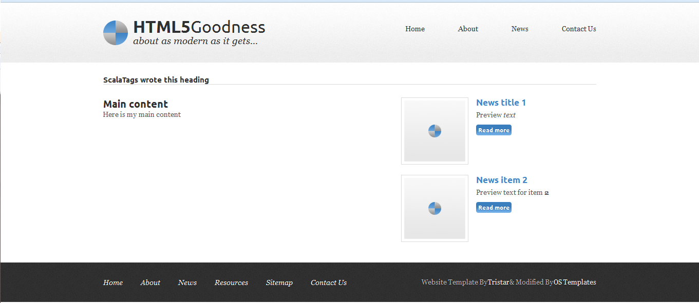

# ScalaTags-gen: a generator for ScalaTags code from HTML templates

This is a simple utility to help in the generation of [ScalaTags](https://github.com/lihaoyi/scalatags) snippets and layouts, based on existing HTML by using [JSoup](http://jsoup.org/) nodes as input.

Although it's a young and simple project, it can handle quite a lot of the work for you. It does not use Scala ASTs internally, but does have a few tricks to produce the code, like proper escaping of strings and using reflection to dynamically determine the list of valid tags and attributes in ScalaTags.

As the generated code will in most cases need some fine tuning by hand, it is currently aimed for interactive use from the Scala REPL. Therefore there is no published artifact. The best is to simply clone this repository somewhere and use the tool in that folder. If you want to use it programatically in another project, the source is only one file at this stage, so that's easy to incorporate.

Pull requests and improvements are most welcome! 

### Untested / unsupported features / issues

* SVG tags and attributes 
* Large and/or deeply nested documents may lead to memory or stack overflow errors

## Basic usage
The `STBuilder` class outputs strings which are (should be, at least) valid Scala source code. It has some parameters for customising the output: what to use as "tab" for indenting (default: two spaces), which alias to use for the "tags2" part of the bundle (default: "t") and which backend to add imports for (default: "text"). 

The main useful function of the class is `buildLayout`. This generates the source for a method which will produce the HTML corresponding to a given node. Importantly, it has the ability to replace the content of certain subnodes in the tree with parameters of the generated method, which allows you to build reusable layout. It is documented further in the source, but the best understanding will come from following the example workflow presented below.

For convenience, there is a `STFileBuilder` class which can be used to construct an entire Scala source file. It has all the parameters of `STBuilder` but also takes the relevant output file name, package and object names to use in generating the source. It has an `addLayout` method which appends a method definition using `STBuilder.buildLayout` (with the same parameters) to the file.

## Example workflow

For an example of building layouts from a theme, we will use the free "HTML5 Goodness" theme. To get started, download the theme from [the HTML5 Goodness theme page](http://www.free-css.com/free-css-templates/page157/html5-goodness) and unzip it as a subfolder of where you've cloned the code.

Then we start the REPL and set the maximum output length shorter to avoid too much noise

    $ sbt console
    [info] Loading ...

    scala>:power
    ...
    scala> vals.isettings.maxPrintString = 100
    vals.isettings.maxPrintString: Int = 100

Next, we load the example document from the theme directory

    scala>   import org.jsoup.Jsoup
    import org.jsoup.Jsoup
    
    scala> val doc=Jsoup.parse(new java.io.File("html5-goodness/index.html"),"UTF-8")
    doc: org.jsoup.nodes.Document =
    <!doctype html>
    <html lang="en">
     <head>
      <title>HTML5 Goodnes...

Now, pick out some nodes: the html element for the root and the elements containing the banner, the main (left) content and the (right) sidebar.

    scala> val html = doc.getElementsByTag("html").first
    html: org.jsoup.nodes.Element =
    <html lang="en">
     <head>
      <title>HTML5 Goodness</title>
      <me...
    scala> val banner = html.getElementById("introduction")
    banner: org.jsoup.nodes.Element =
    <aside id="introduction" class="bodywidth clear">
     
 val left=html.getElementById("aboutleft")
    left: org.jsoup.nodes.Element =
    

     <h3>Awesome Title</h3>
     
Lorem ipsum d...
    scala> val right=html.getElementById("articlesright")
    right: org.jsoup.nodes.Element =
    <section id="articlesright">
     <article>
      <figure>
        val builder=new STFileBuilder("html5goodness.scala","mypackage.views","Html5Goodness")
    builder: STFileBuilder = STFileBuilder@24446cfc

Now we can add the layout for the overall page structure as a method named "page". It will have three parameter groups, by which the content for each of the respective elements can be supplied.

    scala> builder.addLayout(html,"page")(banner->"bannerContent",left->"mainContent",right->"rightContent")

Let's add another layout: for a news item. Again, we need to get hold of the appropriate nodes in the document.

    scala> val newsItem = right.getElementsByTag("article").first
    newsItem: org.jsoup.nodes.Element =
    <article>
     <figure>
       val newsBody = newsItem.getElementsByTag("p").first
    newsBody: org.jsoup.nodes.Element = 
Lorem ipsum dolor sit amet, consectetur adipiscing elit. S...
    scala> val newsHeader = newsItem.getElementsByTag("h5").first
    newsHeader: org.jsoup.nodes.Element = <h5>Random News Article</h5>

Now we can add this layout as well, and then finish off our generated source file

    scala> builder.addLayout(newsItem,"newsItem")(newsHeader->"heading",newsBody->"previewText")
    
    scala> builder.finish

At this stage, you can start editing the generated source file by hand. 
But for this example we're going to do a quick test. Quit the REPL and run `sbt console` again. This will compile the generated source file (since it's in our current directory) and make it available in the REPL.

    scala> exit
    warning: ...
    
    $ sbt console
    [info] Loading global plugins from ...
    [info] Compiling 1 Scala source to ...
    [info] Starting scala interpreter...
    ...

We import our theme and some ScalaTags stuff for some of the implicit conversions

    scala> import mypackage.views.{Html5Goodness=>Theme}
    import mypackage.views.{Html5Goodness=>Theme}
    
    scala> import scalatags.Text.all._
    import scalatags.Text.all._

Let's test the `newsItem` layout

    scala> val news1=Theme.newsItem("News title 1")("Preview ",i("text"))
    news1: scalatags.Text.TypedTag[Nothing] = <article><figure></figure><header><a href="#"><h5>News title 1</h5></a></header>
Preview <i>text</i>
<a href="#" class="readmore">Read more</a></article>

Finally write an entire page to a test file

    scala> val pg=Theme.page(h3("ScalaTags wrote this heading"))(h2("Main content"),p("Here is my main content"))(news1,Theme.newsItem("News item 2")("Preview text for item ",b("2")))
    pg: scalatags.Text.TypedTag[String] = <html lang="en"><head><title>HTML5 Goodness</title><meta charset="utf-8" /><meta name="viewport" content="width=device-width" /><link href="css/styles.css" rel="stylesheet" type="text/css" media="all" /><link href="http://fonts.googleapis.com/css?family=Ubuntu:regular,bold" rel="stylesheet" type="text/css" /><link href="http://fonts.googleapis.com/css?family=Vollkorn:regular,italic,bold" rel="stylesheet" type="text/css" /></head><body>
<header id="mainheader" class="bodywidth clear">
<h1>HTML5Goodness</h1><h2>about as modern as it gets...</h2>
<nav><ul><li><a href="#">Home</a></li><li><a href="#">About</a></li><li><a href="#">New...
    scala> scala.tools.nsc.io.File("html5-goodness/test.html").writeAll(pg.toString)

Open the generated `test.html` file in your browser, and you should see the expected result:

